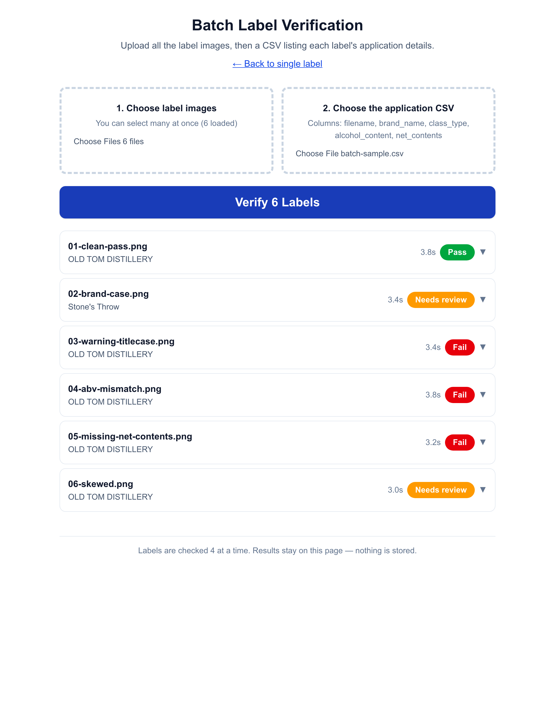
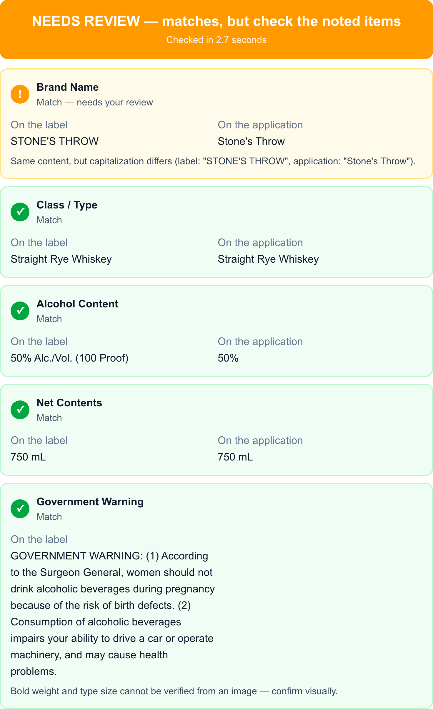

# TTB Label Verification Prototype

[](https://github.com/SunshineCityApps/ttb-label-verify/actions/workflows/test.yml)



AI-assisted verification of alcohol beverage labels against COLA application data. An agent uploads a label image plus the application's stated fields; Claude vision reads the label, and deterministic code verifies every field — per-field results in seconds, with an overall pass / needs-review / fail verdict.

**Live demo:** https://ttb-label-verify-pink.vercel.app

> **Notable design decision** — end-to-end testing caught OCR dropping a period from the government warning on an angled photo, which the word-for-word check turned into a false rejection of a compliant label. The policy shipped in [`52feced`](https://github.com/SunshineCityApps/ttb-label-verify/commit/52feced): wording and capitalization stay strict (title-case lead-ins still fail), while punctuation-only differences become a ⚠️ needs-review item telling the agent to confirm punctuation visually. Full reasoning under [Approach](#approach) and [Assumptions and trade-offs](#assumptions-and-trade-offs).

## Running locally

```bash
npm install
cp .env.example .env.local   # add your ANTHROPIC_API_KEY
npm run dev                  # http://localhost:3000
npm test                     # unit tests for the verification module
```

Sample labels with known expected outcomes are in [`test-labels/`](test-labels/manifest.md) — use the **Fill with sample data** button on the main page, or feed `test-labels/batch-sample.csv` plus all six images to batch mode.

## Approach

### AI extracts, code verifies

The single most important architectural decision. Claude vision does exactly one job: transcribe what is printed on the label into structured JSON (enforced by the API's structured-outputs feature, so there is no fragile JSON parsing). Every pass/fail decision is then made by plain TypeScript in [`lib/verification/`](lib/verification/) — normalized string comparison, numeric ABV parsing, unit-aware volume comparison, and an exact statutory-text check.

Why: in a compliance setting, "the model felt like it matched" is not an explainable answer. Deterministic verification code is unit-testable (45 tests cover it), auditable, and gives identical results for identical inputs. It also means a bad OCR read is visible — the extracted text is shown beside every result so the agent can eyeball-confirm.

### Three-state matching



Each field resolves to **match**, **match with note**, or **mismatch** — not a binary. A label shouting `STONE'S THROW` against an application reading `Stone's Throw` is the same content with different formatting; the tool says so and lets the agent make the call instead of auto-rejecting. Content differences (wrong ABV, missing field) are hard mismatches.

The government warning is the deliberate exception: the statutory text (27 CFR 16.21) must match word-for-word and "GOVERNMENT WARNING:" must be all caps, so it gets an exact comparison — no fuzzy matching. Title-case lead-ins are flagged as violations, and the check pinpoints the first deviating word for reworded text. Two narrow concessions to OCR reality, both surfaced honestly: whitespace is forgiven (reading a wrapped paragraph introduces line breaks), and a *punctuation-only* difference — wording and capitalization identical — becomes a ⚠️ "confirm punctuation visually" review item rather than a hard fail. End-to-end testing on the skewed test label showed OCR can drop a period on an angled photo; hard-failing a good label over that is exactly the false-rejection behavior that makes agents abandon a tool.

### Speed

Extraction runs on `claude-haiku-4-5` (the fastest current Claude model) with a single small vision request — typical end-to-end time is well under the 5-second bar, and the UI shows the measured time on every result. The model is swappable via `CLAUDE_MODEL` if extraction accuracy ever warrants trading a little speed.

### Stateless by design

No database, no stored images, no accounts. The image is processed in memory, results return to the browser, and nothing is retained — which is also the honest answer to federal data-retention and PII questions at prototype stage.

### Batch mode

Batch verification reuses the same stateless endpoint: the browser matches a CSV of application data to uploaded images by filename and works through the queue four labels at a time with live progress. That keeps every server request small and short (friendly to serverless timeouts) and means the batch path exercises exactly the same verified code path as the single-label flow.

## Requirements traceability

Every feature maps to a stakeholder ask from the discovery notes:

| Requirement | Source | Where it lives |
|---|---|---|
| Field-by-field matching of label vs application | Sarah — "a lot of what we do is just… matching" | `lib/verification/`, `/api/verify` |
| Results in ~5 seconds or agents revert to manual | Sarah — the failed vendor pilot (30–40s/label) | Haiku-class model, single small request, elapsed-time readout |
| Exact, all-caps government warning check | Jenny — "it has to be exact… I caught title case last month" | `lib/verification/government-warning.ts` (exact statutory comparison) |
| Judgment on formatting-only differences | Dave — "STONE'S THROW" vs "Stone's Throw" | Three-state matching with explanatory notes |
| Batch upload for 200–300-label dumps | Sarah / Janet (Seattle) | `/batch` — CSV + images, concurrent queue, results table |
| UI a 73-year-old could figure out | Sarah — her mother benchmark; half the team over 50 | One numbered flow, large type, big buttons, plain-language green/amber/red results |
| Tolerate imperfect images; never guess | Jenny — angles, glare, bad lighting | Claude vision handles the skewed test label; unreadable images fail loudly with "request a better image" |
| Standalone, no COLA integration | Marcus | Self-contained app, no external system dependencies |
| No sensitive data storage | Marcus | Fully stateless, nothing persisted |
| Bold/type-size rules can't be checked from an image | Jenny (implied by the warning rules) | Documented limitation — every warning result carries a "confirm visually" note |

Because half the review team is over 50, color is never the sole signal: every pass/needs-review/fail state pairs its green/amber/red with a plain-text label ("Match", "Needs your review", "Mismatch"), the base font stays at 16px+ with results at 18px, and the whole upload → verify flow is keyboard-navigable.

## Assumptions and trade-offs

- **Distilled-spirits field set.** The prototype verifies the five fields in the sample (brand, class/type, ABV, net contents, warning). The remaining TTB elements — name/address of bottler, country of origin for imports, and wine/beer variations (e.g. ABV exceptions) — are out of scope for the prototype but slot into the same extract-then-compare framework as additional field comparators.
- **Warning bold/size is not machine-checked.** Regulation also requires bold type of minimum size; that isn't reliably judgeable from an arbitrary photo, so the tool flags it for visual confirmation instead of pretending to verify it.
- **Proof must equal 2× ABV.** When the label states proof, an internally inconsistent value is flagged as a defect even if the ABV itself matches.
- **Metric and US volumes are never converted across systems.** "25.4 FL OZ" vs "750 mL" is flagged for manual verification rather than trusting a rounding-sensitive conversion in a compliance tool.
- **Batch runs client-side.** Simple and serverless-friendly; the tab must stay open. A production version processing 300-label dumps unattended would move the queue server-side with a job store.
- **Test labels are rendered, not photographed.** `test-labels/generate.py` draws them deterministically so expected results are exact; the skewed variant stands in for imperfect photography. Real-world bottle photos (glare, curvature) would be the next test tier.

## Adversarial testing

The live deployment was attacked with hostile inputs; every failure is a human-readable message — no stack traces, raw 500s, or hung spinners. Two of these started life as ugly failures and were fixed as a result of this pass (commit history has the details):

| Attack | Result |
|---|---|
| Photo that isn't a label (landscape) | 422 — "This image doesn't appear to be an alcohol beverage label." (extraction reports `is_label: false`; previously misreported as "too unclear") |
| PDF renamed to `.jpg` | 400 — "doesn't appear to be a valid image — it may be renamed or corrupted." Magic-byte sniffing catches it server-side; previously surfaced as a misleading "AI service error" 502 |
| 29 MB image | Blocked client-side at 4 MB with a resize suggestion before any upload starts. (Vercel rejects >4.5 MB bodies at the platform layer with a plain-text 413, which the UI previously misreported as a connection error — the API path now also maps 413 to a size message) |
| Unsupported type (GIF, `.txt`) | 400 — "Unsupported image type. Please upload a JPG, PNG, or WebP image." |
| Empty / missing upload | 400 — "Please attach a label image." (the UI blocks the request before it's even sent) |
| Batch CSV naming a file with no matching image | That row reports "No uploaded image matches this filename."; other rows proceed normally |
| Malformed batch CSV (wrong/missing columns) | Rejected on load with the list of missing columns and the expected header |

Blur/unreadable images remain a distinct case: extraction refuses to guess and the agent is told to request a better image (Jenny's requirement).

## Production notes

This prototype calls the public Anthropic API. The agency network blocks outbound traffic to most ML endpoints (it broke the previous vendor's pilot), so a production deployment would use FedRAMP-authorized model hosting — e.g. Claude via AWS GovCloud/Bedrock — plus the usual records-retention and PII review before anything touches real applicant data. The "AI extracts, code verifies" split helps there too: the deterministic verification layer is host-agnostic, so swapping the model endpoint changes nothing about how decisions are made.

## Stack

Next.js 16 (App Router) + TypeScript + Tailwind, Anthropic TypeScript SDK with structured outputs (Zod-validated extraction), Vitest for the verification suite. Deployed on Vercel.
